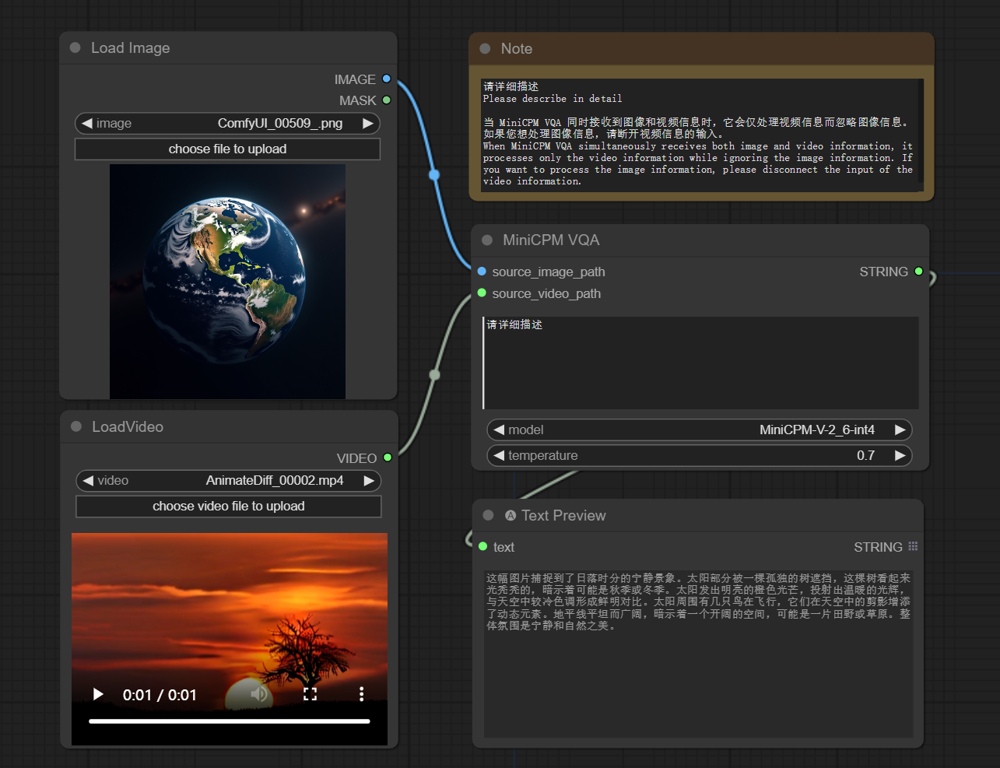

# ComfyUI_MiniCPM-V-2_6-int4

Implementation of [MiniCPM-V-2_6-int4](https://github.com/OpenBMB/MiniCPM-V) by [ComfyUI](https://github.com/comfyanonymous/ComfyUI).

## Basic Workflow

The following [workflow](examples/workflow.json) shows the basic usage on querying an image (or a video)  and generating a caption.



## Installation

- Install from [ComfyUI Manager](https://github.com/ltdrdata/ComfyUI-Manager) (search for `minicpm`)

- Download or git clone this repository into the ComfyUI/custom_nodes/ directory and run:

```python
pip install -r requirements.txt
```

## Download Checkpoints

All the models will be downloaded automatically when running the workflow if they are not found in the `ComfyUI\models\prompt_generator` directory.
