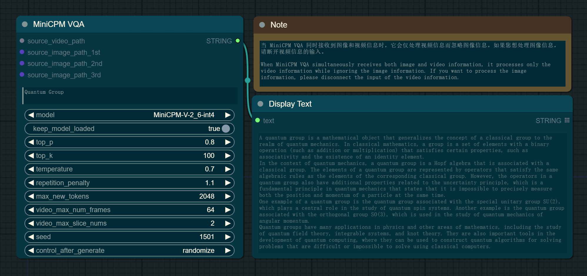
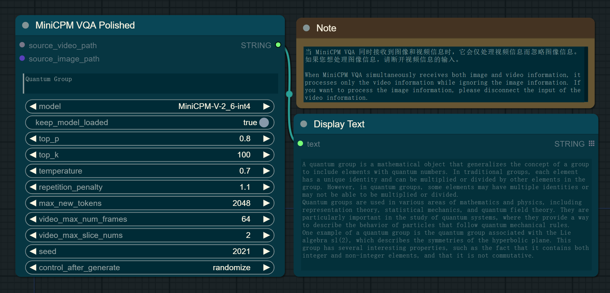
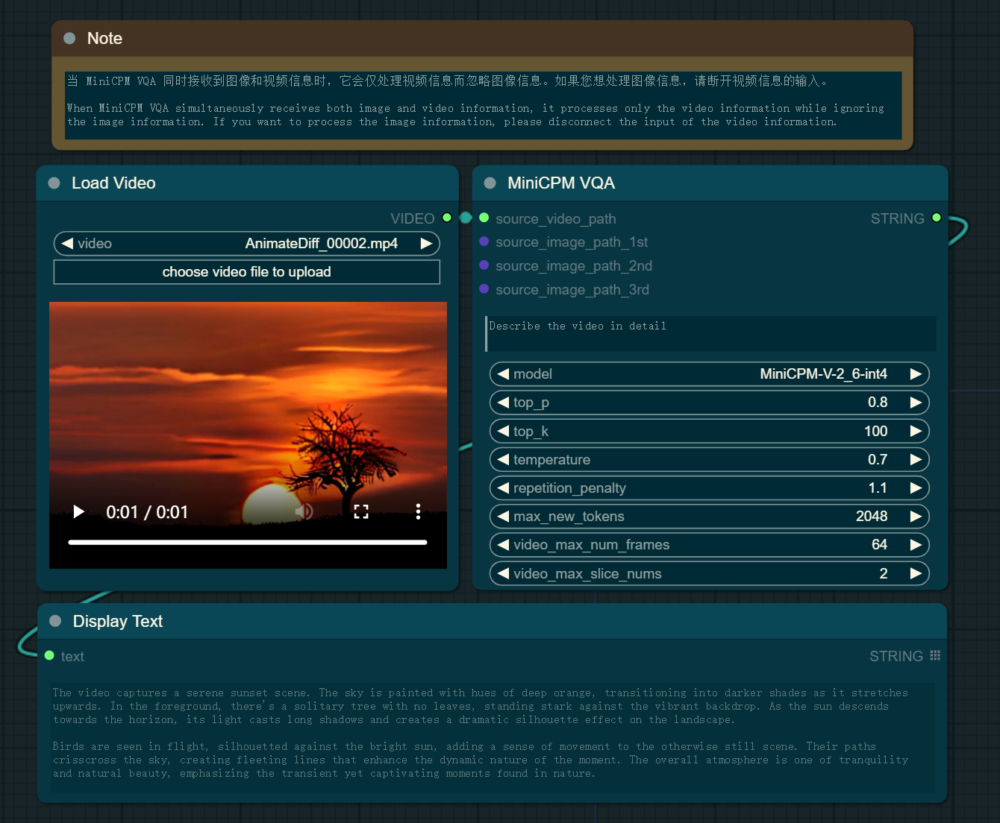
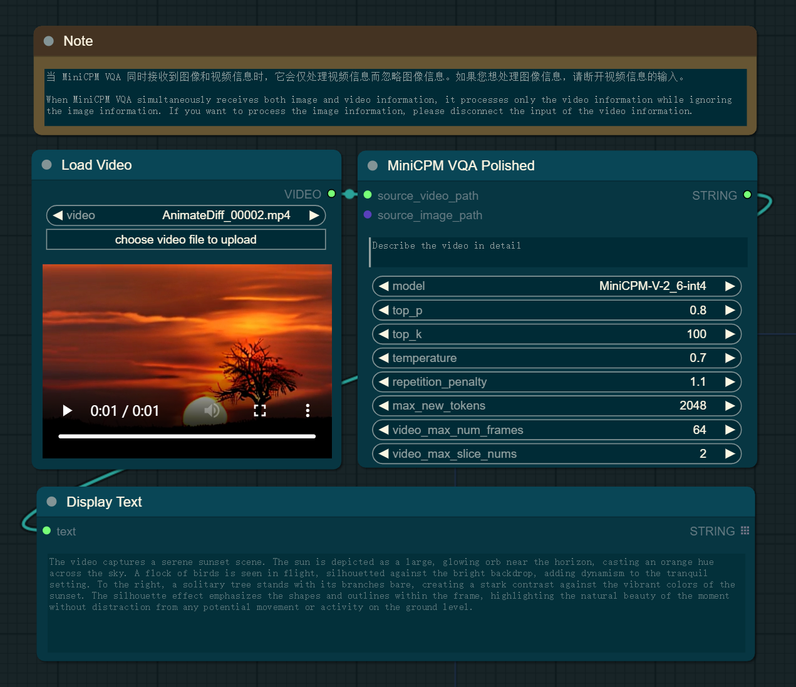
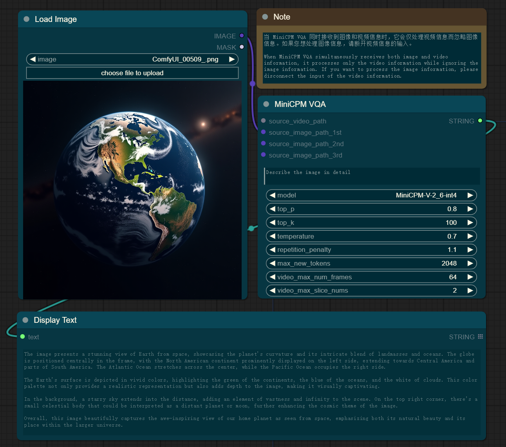
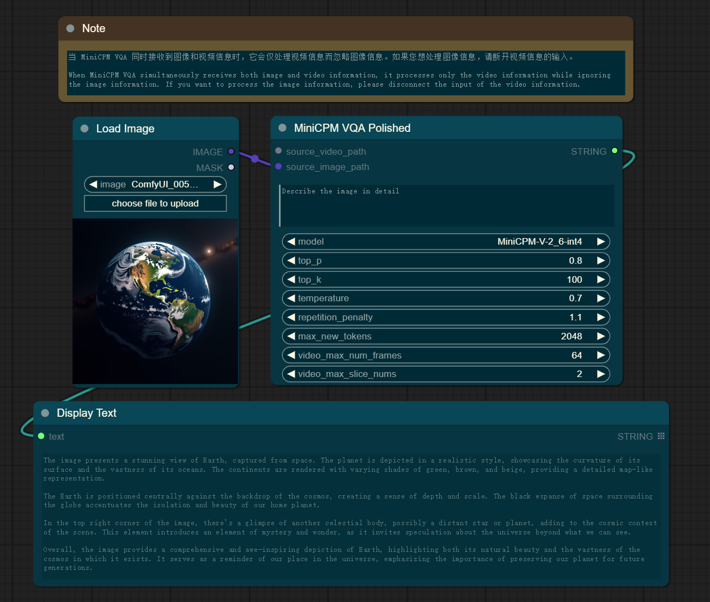
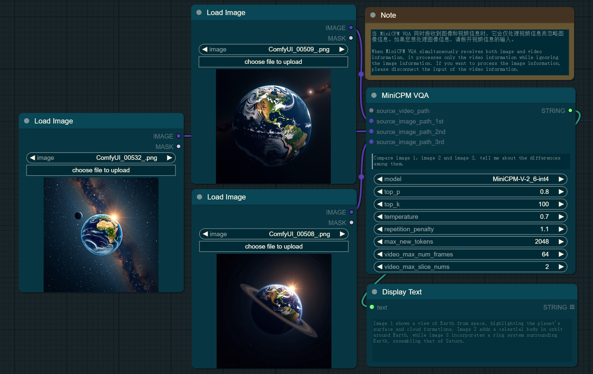
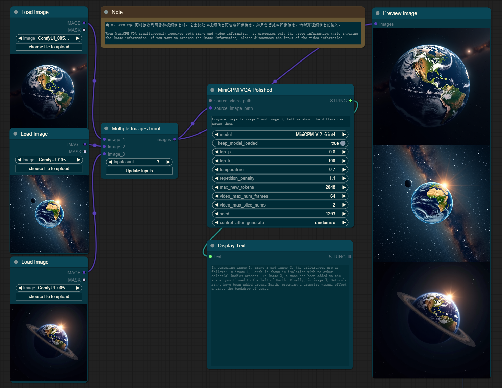
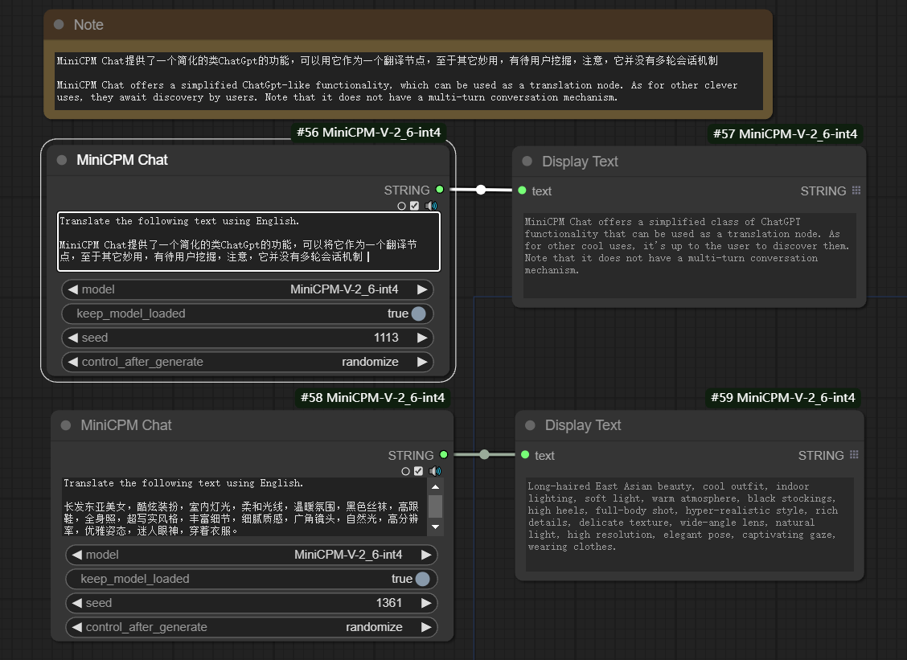

# ComfyUI_MiniCPM-V-2_6-int4

This is an implementation of [MiniCPM-V-2_6-int4](https://github.com/OpenBMB/MiniCPM-V) by [ComfyUI](https://github.com/comfyanonymous/ComfyUI), including support for text-based queries, video queries, single-image queries, and multi-image queries to generate captions or responses.

---

## Recent Updates

- Added `keep_model_loaded` parameter

By default, this parameter is set to False, which indicates that the model will be unloaded from GPU memory after each prediction is made.

However, if set to True, the model will remain loaded in GPU memory. This is particularly useful when multiple predictions with the same model are needed, eliminating the need to reload it between uses.

- Added `seed` parameter

This parameter enables the setting of a random seed for the purpose of ensuring reproducibility in results.

---

## Basic Workflow

- **Text-based Query**: Users can submit textual queries to request information or generate descriptions. For instance, a user might input a description like "What is the meaning of life?"

> <span style="color: green;">Chat_with_text_workflow_legacy preview</span>
> 
> <span style="color: green;">Chat_with_text_workflow_polished preview</span>
> 

- **Video Query**: When a user uploads a video, the system can analyze the content and generate a detailed caption for each frame or a summary of the entire video. For example, "Generate a caption for the given video."

> <span style="color: green;">Chat_with_video_workflow_legacy preview</span>
> 
> <span style="color: green;">Chat_with_video_workflow_polished preview</span>
> 

- **Single-Image Query**: This workflow supports generating a caption for an individual image. A user could upload a photo and ask, "What does this image show?" resulting in a caption such as "A majestic lion pride relaxing on the savannah."

> <span style="color: green;">Chat_with_single_image_workflow_legacy preview</span>
> 
> <span style="color: green;">Chat_with_single_image_workflow_polished preview</span>
> 

- **Multi-Image Query**: For multiple images, the system can provide a collective description or a narrative that ties the images together. For example, "Create a story from the following series of images: one of a couple at a beach, another at a wedding ceremony, and the last one at a baby's christening."

> <span style="color: green;">Chat_with_multiple_images_workflow_legacy preview</span>
> 
> <span style="color: green;">Chat_with_multiple_images_workflow_polished preview</span>
> 

- **ChatGpt-like Query**: Users can submit a query and wait for the results to return. For example, using it as a translation node, as shown below:

> <span style="color: green;">ChatGpt-like_workflow preview</span>
> 

## Installation

- Install from [ComfyUI Manager](https://github.com/ltdrdata/ComfyUI-Manager) (search for `minicpm`)

- Download or git clone this repository into the `ComfyUI\custom_nodes\` directory and run:

```python
pip install -r requirements.txt
```

## Download Models

All the models will be downloaded automatically when running the workflow if they are not found in the `ComfyUI\models\prompt_generator\` directory.
